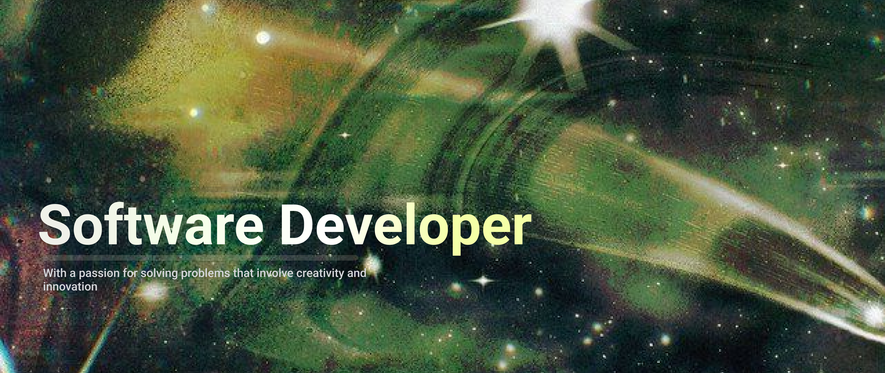

<h3 align="left">About Me</h3>
<h2 align="left"></h2>

Software Developer specializing in android applications. I focus on creating intuitive digital experiences with a strong vision on UX design and process automation.</

###
<h3 align="left">What Drives Me</h3>

I'm passionate about solving real-world problems through code. Whether it's automating tedious processes or crafting beautiful user interfaces, I believe technology should make life easier and more efficient.

###
<h2 align="left"></h2>
<h3 align="left">Tech Stack</h3>

                       

###

###
